# Week 2 – Data Lakes, ETL & Advanced MDM Governance

**Dataset:** NYC Yellow Taxi Trips  
**Focus:** Data Lakes, ETL, Delta Lake, Data Quality, Advanced MDM  
**Tools:** AWS S3, AWS Glue, PySpark, Delta Lake, RDS, GitHub Actions  

---

## Week Objective

Design and implement a **governed data lake architecture** with:
- Multi-zone storage (raw → validated → curated → master)
- ETL pipelines with **quality gates**
- Delta Lake for **ACID, time travel, and auditability**
- Advanced **MDM matching, deduplication, and lifecycle governance**

---

## Data Lake Architecture Overview

### Zones & Purpose
| Zone | Purpose | Governance Level |
|----|----|----|
| Raw | Original source data | None |
| Validated | Basic quality checks | Technical |
| Curated | Business rules applied | Business |
| Master | Golden records only | Strict |
| Archive | Compliance retention | Immutable |

---

## Day 6 – Modern Data Lakes & Storage Strategies

### Topics Covered
- Data lake vs warehouse vs mart
- Lakehouse architecture
- File formats: Parquet vs ORC vs Avro
- Delta Lake vs Iceberg vs Hudi
- Metadata & cataloging (Glue Catalog)
- Governance zones & access patterns

### Hands-on
- Created S3 zones:
  - `raw/`
  - `validated/`
  - `curated/`
  - `master/`
  - `archive/`
- Applied bucket-level governance
- Registered datasets in Glue Catalog

**Screenshots**
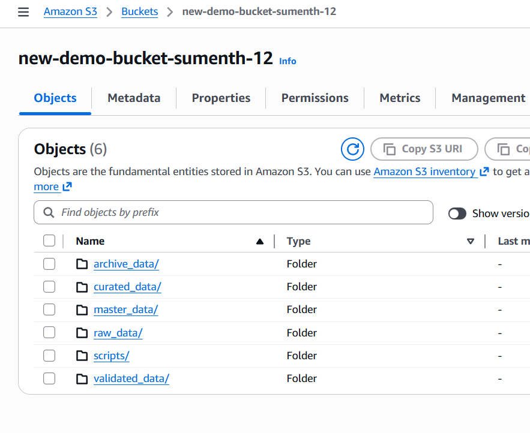

**Key Learnings**
- Governance differs by zone
- Raw data must remain immutable
- Delta enables lakehouse reliability
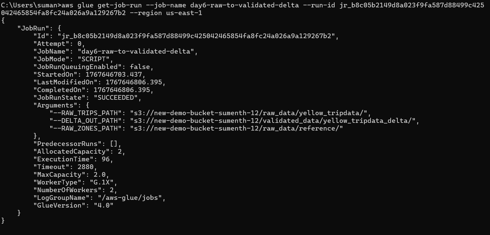
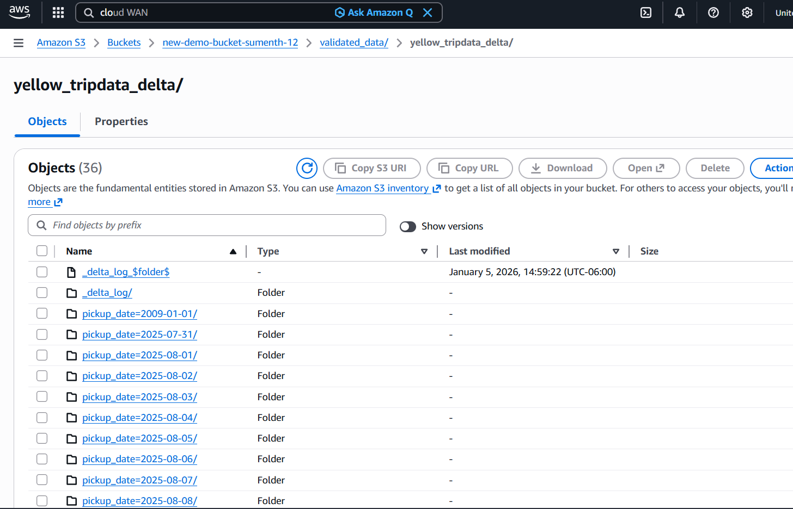
[day_6_script](./glue_jobs/day6_datalake_delta_raw_to_validated_glue.py)
---

## Day 7 – ETL Pipelines with AWS Glue & PySpark

### Topics Covered
- ETL vs ELT
- Glue job architecture
- Schema enforcement vs schema evolution
- Error handling & logging
- Parameterized Glue jobs

### Hands-on
- Built Glue job: `raw → validated`
- Applied:
  - Null checks
  - Schema validation
  - Referential integrity
- Wrote validated data as **Delta tables**

**Screenshots**
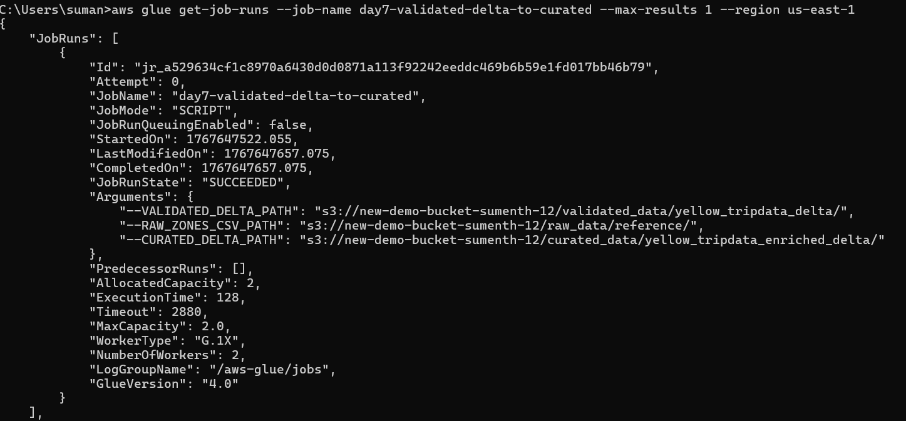
[day_7_script](./glue_jobs/day7_spark_enrich_and_catalog_prep.py)
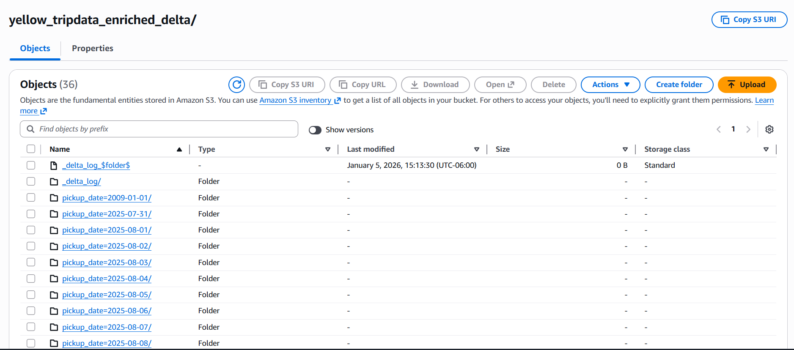

**Key Learnings**
- Quality checks must block bad data early
- Delta tables bring ACID guarantees to S3

---

## Day 8 – Data Quality Framework & Governance Dashboard

### Data Quality Dimensions
- Accuracy
- Completeness
- Consistency
- Timeliness
- Validity
- Uniqueness

### Governance Mapping
| Quality Dimension | Business Metric | Owner | Threshold | Action |
|----|----|----|----|----|
| Completeness | % null trips | Data Steward | < 1% | Block load |
| Validity | Zone match | Data Owner | 100% | Reject rows |

### Hands-on
- Implemented quality rules (YAML)
- Generated quality metrics tables
- Designed governance dashboard concepts:
  - Quality scorecard
  - Orphan records
  - Steward queue

**Screenshots**
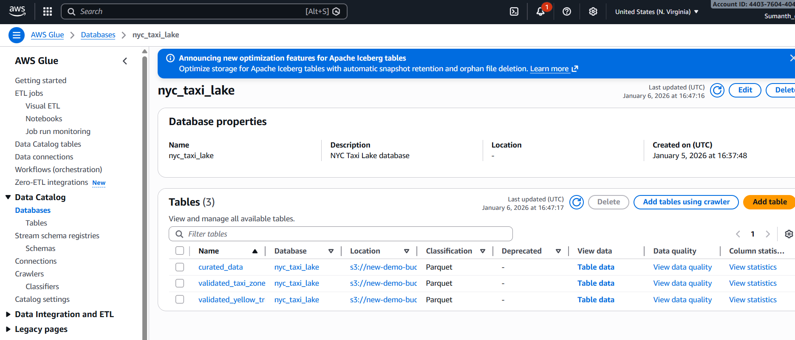
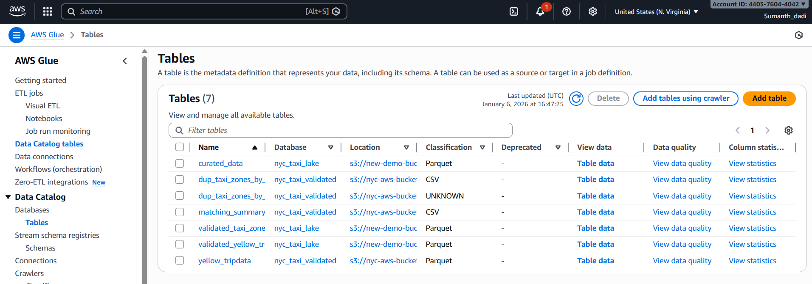
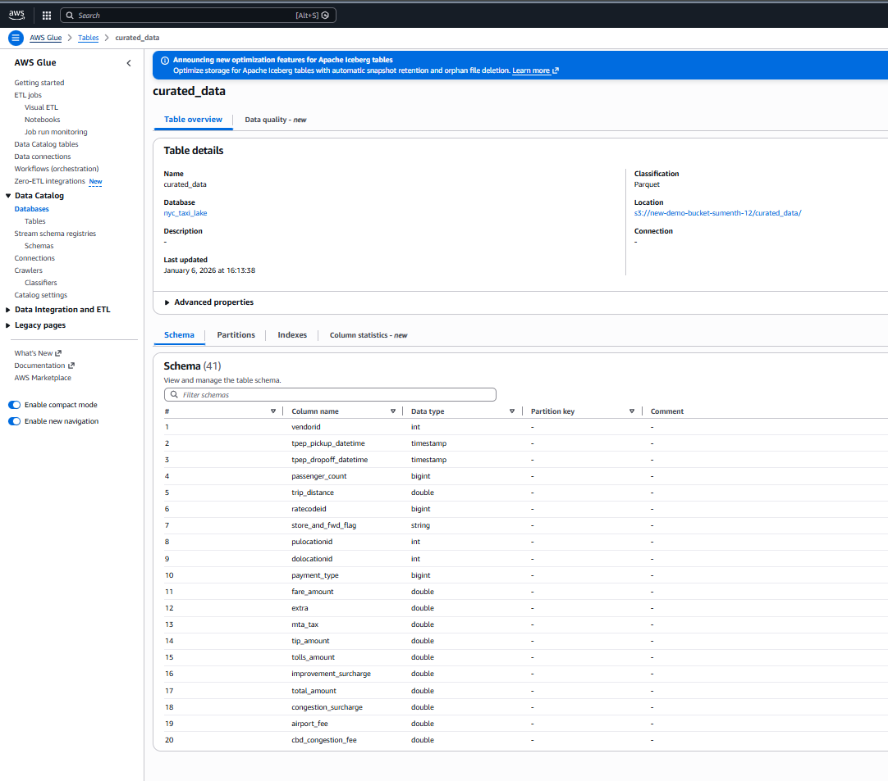
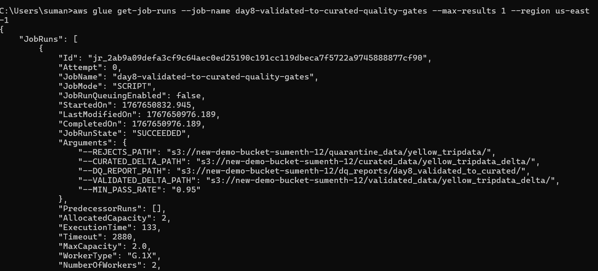
[day_8_script](./glue_jobs/day8_glue_quality_gates_validated_to_curated.py)

**Key Learnings**
- Quality must be measurable
- Business owners define thresholds
- Governance requires visibility

---

## Day 9 – Advanced MDM: Matching & Deduplication

### Matching Techniques
- Exact matching
- Fuzzy matching (Levenshtein, Jaro-Winkler)
- Confidence scoring
- Survivorship rules

### Match Confidence Thresholds
| Confidence | Action |
|----|----|
| > 95% | Auto-merge |
| 80–95% | Steward review |
| < 80% | Manual resolution |

### Hands-on
- Built deduplication pipeline
- Generated match confidence scores
- Created steward review queue
- Logged merge decisions

**Dedup Pipeline**
Source → Matching → Scoring → Decision

**Screenshots**
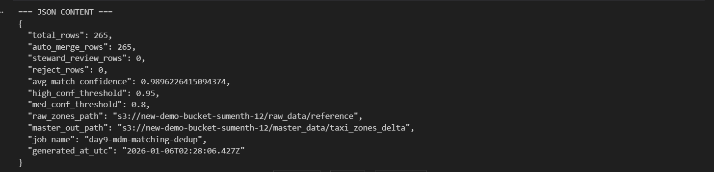
[day 9 script](./glue_jobs/day9_mdm_matching_dedup_engine.py)

**Key Learnings**
- Not all matches should be automated
- Steward workflows are critical
- Confidence drives governance actions

---

## Day 10 – Master Data Lifecycle & Auditability

### Master Data Lifecycle
- Proposed
- Active
- Deprecated
- Retired

### Governance Features
- Change approval workflows
- CDC for master data
- Audit trail using Delta history
- Time travel for compliance

### Hands-on
- Implemented lifecycle state column
- Captured change history
- Used Delta Lake time travel for audits

**Screenshots**
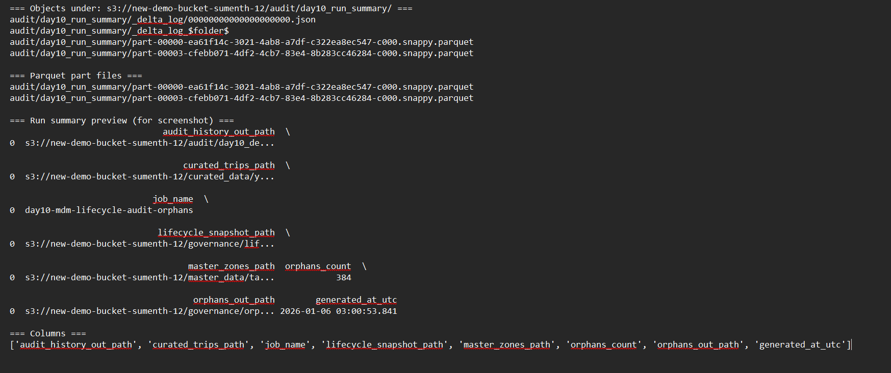

**Key Learnings**
- Auditability is mandatory
- Delta time travel simplifies compliance
- Lifecycle states prevent uncontrolled changes

---

##  Week 2 Deliverables

-  Governed data lake architecture
-  Glue ETL pipelines with quality gates
-  Delta Lake tables with audit history
-  Advanced MDM deduplication pipeline
-  Steward review workflow design
-  Data quality scorecard framework

---

##  Final Takeaways

- Data lakes require **governance by design**
- Quality gates prevent downstream failures
- Delta Lake enables enterprise-grade reliability
- MDM is continuous, not one-time

